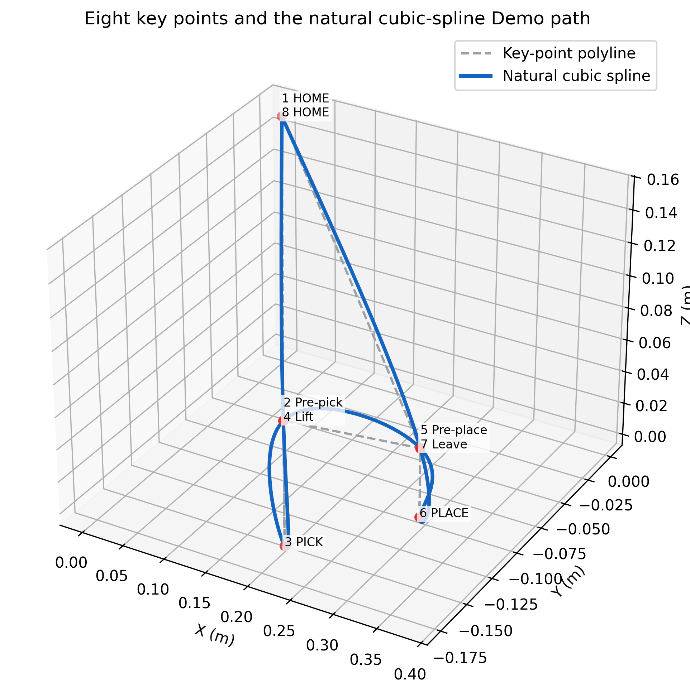
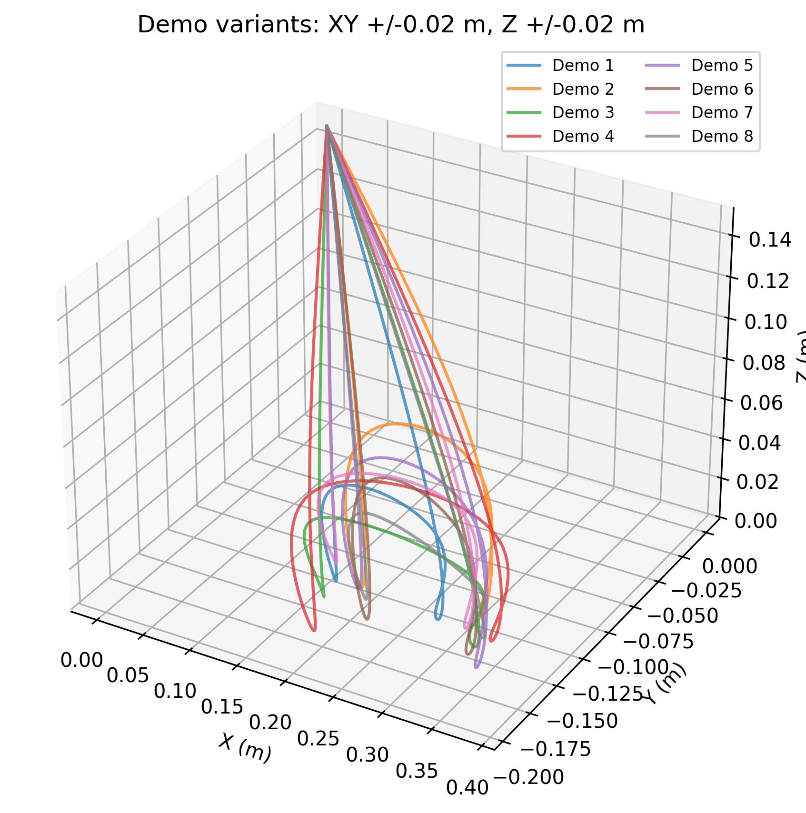

# Dobot Magician 轨迹学习仿真项目接手与复现手册

这份手册面向只掌握 Python 基础、第一次接触 CoppeliaSim 的同学。建议先完整跑通第 5 章的最短复现流程，再修改算法、数据或场景。

## 1. 先看这里：当前项目做到什么程度

### 1.1 当前已经实现

- 使用 8 条合成示教轨迹训练四种 GMM-GMR 运动基元算法。
- 每条轨迹包含 150 个时刻，训练维度为 `x、y、z、gripper`。
- 自动保存四个模型、四张单算法轨迹图、一张算法对比图和两种格式的指标表。
- 在 CoppeliaSim 简化场景中直接驱动自由移动夹爪，执行单个放置点的抓取、搬运和释放，并播放至所选模型轨迹的最后一个点。
- 可以在配置文件中切换需要回放的算法。
- 当前自动化测试共 5 项，已全部通过。

### 1.2 当前没有实现

- 没有在真实 Dobot Magician 机械臂上运行或验证。
- 没有完整机械臂模型、逆运动学（IK）和关节轨迹控制，也没有验证机械臂可达性。
- 没有 2×3 多点码垛；当前只配置了 1 个放置点。
- 没有 RRT 或其他运动规划、避障和碰撞检测。
- 没有接触抓取验证；当前抓取是达到夹爪阈值后把物块绑定到夹爪，不模拟接触力、摩擦或夹持失败。
- 多数模型的“采样轨迹”目前是均值轨迹的复制，不代表完整的随机概率采样。

> **重要：** 本项目当前应描述为“基于 CoppeliaSim 简化自由夹爪场景的单点码垛轨迹学习仿真”。论文、PPT 或预期方案中的完整机械臂、避障和实机目标，不能直接写成当前仓库已经实现的功能。

### 1.3 成功复现时应该看到什么

1. `pytest` 显示 `5 passed`。
2. `models/` 中存在四个 `.joblib` 模型。
3. `models/` 中存在四张单算法图和 `trajectory_comparison.png`。
4. `models/algorithm_metrics.csv` 中，分段 DMP 的 Pearson 均值最高（`0.9934`），Inc-GMM+GMR+DMP 的 RMSE 均值最低（`0.0123`）。
5. 打开仿真场景并执行回放后，夹爪沿所选模型的 150 点轨迹完成抓取、搬运和释放；脚本播放到模型轨迹末端后停止仿真。

以上结论分别以 [`configs/default.yaml`](../configs/default.yaml)、[`models/algorithm_metrics.csv`](../models/algorithm_metrics.csv)、[`src/dobot_bgmm_promp/scripts/play_coppeliasim.py`](../src/dobot_bgmm_promp/scripts/play_coppeliasim.py) 和 [`src/dobot_bgmm_promp/coppeliasim_client.py`](../src/dobot_bgmm_promp/coppeliasim_client.py) 为证据。回放代码没有在轨迹结束后额外发送“返回 HOME”命令；即使模型末端接近 HOME，也只能表述为播放到了模型轨迹末端。

## 2. 用最少理论理解四种算法

### 2.1 一条示教轨迹是什么

一条示教轨迹可以理解为“每个时刻夹爪应该在哪里、处于什么状态”。本项目的数据列为：

```csv
t,x,y,z,gripper
0.000,0.000,0.000,0.150,0.000
```

- `t`：时间。
- `x、y、z`：夹爪在世界坐标系中的位置。
- `gripper`：夹爪状态，`0` 表示打开，`1` 表示闭合，中间值用于平滑过渡。

数据加载代码位于 [`src/dobot_bgmm_promp/io.py`](../src/dobot_bgmm_promp/io.py)，合成数据生成代码位于 [`src/dobot_bgmm_promp/scripts/generate_palletizing_demos.py`](../src/dobot_bgmm_promp/scripts/generate_palletizing_demos.py)。

### 2.2 GMM 和 GMR

- **GMM（高斯混合模型）**：把轨迹中的不同阶段用若干高斯分量表示，例如接近物块、抬升、搬运和释放阶段。
- **GMR（高斯混合回归）**：给定归一化时间，根据 GMM 得到该时刻的 `x、y、z、gripper` 预测值。

GMR 的条件均值计算位于 [`src/dobot_bgmm_promp/gmr.py`](../src/dobot_bgmm_promp/gmr.py)。四种方法都先建立“时间与轨迹输出”的联合分布，再通过 GMR 得到参考轨迹。

### 2.3 DMP 和分段 DMP

- **DMP（动态运动基元）**：用稳定动力系统和基函数重建一条平滑轨迹。
- **分段 DMP**：把参考轨迹分成多个片段，每段分别拟合 DMP，最后按顺序拼接。它更容易保留抓取、搬运和释放等不同阶段的局部形状。

DMP 实现在 [`src/dobot_bgmm_promp/dmp.py`](../src/dobot_bgmm_promp/dmp.py)，分段组合逻辑在 [`src/dobot_bgmm_promp/gmr_primitives.py`](../src/dobot_bgmm_promp/gmr_primitives.py) 的 `_segmented_dmp_rollout` 中。

当前分段 DMP 先把 150 点 GMR 参考轨迹交给 `numpy.array_split(reference, 4)`。由于 150 不能被 4 整除，四段实际长度是 `38/38/37/37`，不是四个完全等长的 37.5 点片段；每段独立拟合后再按原顺序拼接。

### 2.4 增量 GMM、BGMM 和 ProMP

- **增量 GMM**：逐个读取样本，根据距离决定更新已有分量还是新建分量，适合研究在线学习。当前简化实现位于 [`src/dobot_bgmm_promp/incremental_gmm.py`](../src/dobot_bgmm_promp/incremental_gmm.py)。
- **BGMM（贝叶斯 GMM）**：使用贝叶斯高斯混合模型和狄利克雷过程先验估计混合分量。
- **ProMP（概率运动基元）**：通常用基函数权重的概率分布描述轨迹。本项目当前只对 GMR 轨迹做确定性的高斯基函数重构，尚未实现完整的权重分布采样。

### 2.5 四种算法与代码类的对应关系

| 配置 ID | 报告名称 | Python 类 |
| --- | --- | --- |
| `gmm_gmr_dmp` | GMM+GMR+DMP | `GMMGMRDMP` |
| `inc_gmm_gmr_dmp` | Inc-GMM+GMR+DMP | `IncGMMGMRDMP` |
| `gmm_gmr_segmented_dmp` | GMM+GMR+Segmented DMP | `GMMGMRSegmentedDMP` |
| `bgmm_gmr_promp` | BGMM+GMR+ProMP | `BGMMGMRProMP` |

四个类都在 [`src/dobot_bgmm_promp/gmr_primitives.py`](../src/dobot_bgmm_promp/gmr_primitives.py)，提供统一接口：

```python
fit(demos)
mean_trajectory()
sample_trajectories(n_samples)
component_trajectories()
trajectory_for_place(place_index, place_positions)
```

### 2.6 当前训练参数快照

下表抄录自 [`configs/default.yaml`](../configs/default.yaml)，用于保证报告文字、复现实验和实际运行参数一致。四种算法都输出 150 个时刻的轨迹。

| 算法 | 混合模型参数 | 运动基元参数 | 其他关键参数 |
| --- | --- | --- | --- |
| GMM+GMR+DMP | `n_components=8`，`covariance_type=full`，`reg_covar=1e-6`，`random_state=7` | `dmp_basis=15`，`dmp_alpha_z=25.0`，`dmp_beta_z=6.25`，`dmp_alpha_s=1.0` | `ridge_lambda=1e-6` |
| Inc-GMM+GMR+DMP | `inc_lam=0.25` | `dmp_basis=50`，`dmp_alpha_z=25.0`，`dmp_beta_z=6.25`，`dmp_alpha_s=1.0` | `ridge_lambda=1e-6` |
| GMM+GMR+Segmented DMP | `n_components=8`，`covariance_type=full`，`reg_covar=1e-6`，`random_state=7` | `dmp_basis=35`，`dmp_alpha_z=25.0`，`dmp_beta_z=6.25`，`dmp_alpha_s=4.0` | `n_segments=4`（实际 `38/38/37/37` 点），`ridge_lambda=1e-6` |
| BGMM+GMR+ProMP | `n_components=8`，`covariance_type=full`，`reg_covar=1e-6`，`random_state=7` | `promp_basis=25`，`promp_basis_width=0.08` | `ridge_lambda=1e-6` |

当前回放选择为 `model.active_algorithm: bgmm_gmr_promp`。`model.algorithm: compare` 控制训练时依次运行四种算法，二者不要混淆。

## 3. 项目目录地图

```text
configs/
  default.yaml                       训练与仿真配置
data/demos_single_place/
  demo_01.csv ... demo_08.csv        当前验证使用的 8 条示教轨迹
models/
  *.joblib                           训练后的模型
  *.png                              单算法图和对比图
  algorithm_metrics.csv              完整指标表
  algorithm_metrics.md               Markdown 指标摘要
scenes/
  gripper_palletizing.ttt            简化夹爪码垛场景
src/dobot_bgmm_promp/
  gmr_primitives.py                  四种组合算法
  gmr.py                             GMR
  dmp.py                             DMP
  incremental_gmm.py                 增量 GMM
  metrics.py                         Pearson 与 RMSE
  plotting.py                        结果绘图
  coppeliasim_client.py              仿真连接和回放
  scripts/
    learn.py                         训练、评价、保存模型和绘图
    play_coppeliasim.py              选择模型并回放
    generate_palletizing_demos.py    生成合成示教数据
    record_coppeliasim.py            从仿真记录位置（当前不记录 gripper）
    create_gripper_palletizing_scene.py  从源场景生成简化场景
tests/
  test_bgmm_promp.py                 当前 5 项自动化测试
```

## 4. Windows 环境准备

### 4.1 软件要求

- Windows 10 或 Windows 11。
- Python 3.10 或更高版本。
- CoppeliaSim Edu，且能使用 ZeroMQ Remote API。
- PowerShell。

先在项目根目录执行：

```powershell
python --version
```

预期看到 `Python 3.10` 或更高版本。如果同时安装了多个 Python，可使用 `py -3.12` 等 Python Launcher 命令创建环境。

### 4.2 创建虚拟环境

```powershell
python -m venv .venv
.\.venv\Scripts\Activate.ps1
python -m pip install -U pip
python -m pip install -e ".[dev]"
```

成功后，PowerShell 提示符前通常会出现 `(.venv)`。重新打开 PowerShell 时需要再次执行：

```powershell
.\.venv\Scripts\Activate.ps1
```

如果 PowerShell 阻止激活脚本，可只对当前窗口执行：

```powershell
Set-ExecutionPolicy -Scope Process -ExecutionPolicy Bypass
.\.venv\Scripts\Activate.ps1
```

### 4.3 先跑测试

```powershell
python -m pytest -q -p no:cacheprovider
```

当前版本的预期输出为：

```text
.....
5 passed
```

如果这里失败，先不要启动仿真。按照第 9 章排查 Python 环境和依赖。

## 5. 最短复现流程

### 5.1 不重新生成数据，直接训练当前基线

当前 `data/demos_single_place/` 已经包含 8 条验证数据。执行：

```powershell
python -m dobot_bgmm_promp.scripts.learn --config configs/default.yaml
```

默认配置中的：

```yaml
model:
  algorithm: compare
```

表示依次训练全部四种算法。正常运行后会更新：

- `models/gmm_gmr_dmp.joblib`
- `models/inc_gmm_gmr_dmp.joblib`
- `models/gmm_gmr_segmented_dmp.joblib`
- `models/bgmm_gmr_promp.joblib`
- 四张 `learned_trajectory_*.png`
- `models/trajectory_comparison.png`
- `models/algorithm_metrics.csv`
- `models/algorithm_metrics.md`

训练命令会改写这些模型和结果文件。准备提交代码前，要先确认这些变化是不是本次实验需要保留的结果。

### 5.2 检查当前指标

打开 [`models/algorithm_metrics.md`](../models/algorithm_metrics.md) 或执行：

```powershell
Import-Csv models/algorithm_metrics.csv |
  Select-Object Algorithm,'Pearson Mean','RMSE Mean' |
  Format-Table
```

当前基线结果为：

| 算法 | Pearson 均值 | RMSE 均值 |
| --- | ---: | ---: |
| GMM+GMR+DMP | 0.9871 | 0.0187 |
| Inc-GMM+GMR+DMP | 0.9927 | 0.0123 |
| GMM+GMR+Segmented DMP | 0.9934 | 0.0139 |
| BGMM+GMR+ProMP | 0.9867 | 0.0205 |

Pearson 越接近 `1` 表示曲线变化趋势越相似；RMSE 越小表示数值误差越小。当前数据上，分段 DMP 的 Pearson 均值最高，Inc-GMM+GMR+DMP 的 RMSE 均值最低，因此不能笼统地把某一种方法写成两个指标都最优。这里的数值来自当前 [`models/algorithm_metrics.csv`](../models/algorithm_metrics.csv)，重新训练或更换数据后必须同步更新，不能从旧报告抄写。

### 5.3 打开仿真场景

1. 启动 CoppeliaSim Edu。
2. 打开 [`scenes/gripper_palletizing.ttt`](../scenes/gripper_palletizing.ttt)。
3. 暂时不要点击运行按钮；回放脚本默认会启动和停止仿真。
4. 确认场景树中能找到第 6.3 节列出的对象。
5. 确认 ZeroMQ Remote API 使用 `127.0.0.1:23000`。如果你修改了端口，也要同步修改 `configs/default.yaml`。

### 5.4 选择回放算法

编辑 [`configs/default.yaml`](../configs/default.yaml)：

```yaml
model:
  algorithm: compare
  active_algorithm: bgmm_gmr_promp
```

`active_algorithm` 可以是：

```text
gmm_gmr_dmp
inc_gmm_gmr_dmp
gmm_gmr_segmented_dmp
bgmm_gmr_promp
```

### 5.5 回放轨迹

保持 CoppeliaSim 场景打开，然后在项目根目录执行：

```powershell
python -m dobot_bgmm_promp.scripts.play_coppeliasim `
  --config configs/default.yaml `
  --place-index 1
```

预期过程：

1. 连接 `127.0.0.1:23000`。
2. 找到 `/GripperBase`。
3. 启动仿真。
4. 按 150 个轨迹点移动夹爪。
5. `gripper` 达到抓取阈值时闭合夹爪并绑定物块。
6. 轨迹后半段 `gripper` 低于释放阈值时解除绑定并释放物块。
7. 播放完模型轨迹的最后一点后停止仿真。

如果你已经手动启动仿真，可以添加 `--no-start`，但第一次复现不建议这样做。

> **边界说明：** `play_coppeliasim.py` 只把模型给出的轨迹传给 `play_cartesian_trajectory()`。客户端按顺序遍历这些点，循环结束后没有独立的 HOME 轨迹或 HOME 控制命令。因此回放结果应写成“到达模型轨迹末端”，不能仅凭合成 Demo 的最后一个关键点名为 HOME，就声称程序额外执行了返回 HOME。

## 6. 数据格式与配置文件

### 6.1 当前示教数据

训练器从 `data.demos_dir` 指定的目录读取所有 `*.csv`。每个文件都必须：

- 有表头；
- 至少有两行数据；
- 包含 `t、x、y、z、gripper`；
- `t` 可以乱序，加载时会自动排序；
- 所有文件使用相同的输出维度。

当前 8 条数据是程序生成的合成轨迹，不是实机拖动示教数据。生成过程使用 8 个关键阶段：起点、取物点上方、取物、抬升、放置点上方、放置、离开和返回起点。

### 6.2 基于三次样条生成 Demo 路径

当前项目的主要数据准备工作，是把少量动作关键点扩展成可供模型学习的完整 Demo。每条 Demo 先定义 8 个阶段，再使用自然三次样条生成 150 个连续采样点。

| 序号 | 动作阶段 | 夹爪关键状态 |
| ---: | --- | ---: |
| 1 | HOME 起点 | 0 |
| 2 | 取物点上方 | 0 |
| 3 | PICK 取物 | 1 |
| 4 | 抬升 | 1 |
| 5 | 放置点上方 | 1 |
| 6 | PLACE 放置 | 0 |
| 7 | 离开放置点 | 0 |
| 8 | 返回 HOME | 0 |

生成流程如下：

1. 根据 HOME、PICK、PLACE 和抬升高度构造 8 个关键点。
2. 使用 `NOISE_XY` 和 `NOISE_Z` 对取放位置及高度加入小范围随机扰动。
3. 在归一化相位 `[0, 1]` 上使用 `CubicSpline(..., bc_type="natural")` 插值位置和夹爪状态。
4. 将结果采样为 150 个时刻，把夹爪值裁剪到 `[0, 1]`，再输出 `t,x,y,z,gripper` CSV。

```text
定义 8 个动作关键点和夹爪状态
对 PICK、PLACE 和抬升高度加入小范围随机扰动
执行自然三次样条插值
组合 150 个位置与夹爪采样点
输出 t, x, y, z, gripper CSV
```



图 6-1 8 个动作关键点与自然三次样条 Demo 路径。虚线表示直接连接关键点的折线，蓝色曲线表示插值后的连续路径。



图 6-2 由关键点扰动生成的多条 Demo。曲线差异来自 `NOISE_XY = 0.02` 和 `NOISE_Z = 0.02`，不是四种学习算法的输出差异。

| 参数 | 当前值 | 作用 | 修改后重点检查 |
| --- | ---: | --- | --- |
| `N_TIME_STEPS` | 150 | 每条 Demo 的采样点数 | CSV 行数、训练输入长度和回放时长 |
| `NOISE_XY` | 0.02 | 取放点平面位置扰动范围 | 轨迹是否仍位于合理工作区域 |
| `NOISE_Z` | 0.02 | 取放高度和抬升高度扰动范围 | 是否出现穿过台面或抬升不足 |

三次样条的作用是让相邻阶段之间连续过渡，比直接用折线连接关键点更适合生成平滑的示教路径。这里的路径仍是合成数据，没有经过完整机械臂逆运动学、碰撞检测或实机可达性验证。

### 6.3 安全地试验数据生成器

不要第一次就把生成结果写入当前基线目录。使用临时目录：

```powershell
python -m dobot_bgmm_promp.scripts.generate_palletizing_demos `
  --output-dir .codex_tmp/reproduction-demos `
  --n-per-pose 8 `
  --seed 42
```

检查结果：

```powershell
Get-ChildItem .codex_tmp/reproduction-demos -Filter *.csv
Get-Content .codex_tmp/reproduction-demos/demo_01.csv -TotalCount 3
```

> **警告：** 当前论文基线是 8 条 Demo，必须写入一个空目录。生成器采用追加编号，不会自动清空目录；对同一目录重复运行会继续追加文件，导致训练样本数量变化，不能再视为同一组基线。

### 6.4 CoppeliaSim 关键对象

| 配置项 | 当前对象 | 用途 |
| --- | --- | --- |
| `target_path` | `/GripperBase` | 每个时刻直接设置位置的目标对象 |
| `tip_path` | `/GripperBase/GripCenter` | 物块绑定参考点 |
| `left_gripper_joint_path` | 左夹爪关节路径 | 控制左夹爪开合 |
| `right_gripper_joint_path` | 右夹爪关节路径 | 控制右夹爪开合 |
| `block_path` | `/PalletBlock` | 被搬运物块 |
| 场景标记 | `/PickPoint` | 取物位置提示 |
| 场景标记 | `/Place_01` | 唯一放置位置提示 |

对象路径必须和 CoppeliaSim 场景树中的 Alias/路径完全一致。

### 6.5 常用配置项

| 配置项 | 作用 | 修改时注意 |
| --- | --- | --- |
| `model.algorithm` | 训练一个算法或 `compare` 全部训练 | 合法值必须与代码 ID 一致 |
| `model.active_algorithm` | 回放时加载哪个模型 | 对应模型文件必须已生成 |
| `coppeliasim.host` | Remote API 主机 | 本机一般为 `127.0.0.1` |
| `coppeliasim.port` | Remote API 端口 | 默认 `23000` |
| `coppeliasim.target_path` | 被直接移动的对象 | 路径错误会立即报错 |
| `coppeliasim.tip_path` | 物块绑定参考点 | 找不到时会退回到 target |
| `coppeliasim.block_path` | 被搬运物块 | 找不到时轨迹仍动，但物块不跟随 |
| `coppeliasim.pick_position` | 设计取物位置 | 当前抓取逻辑主要依赖阈值，不做碰撞判断 |
| `coppeliasim.place_positions` | 放置点列表 | 当前只有 1 个点 |
| `pickup_threshold` | 开始绑定物块的夹爪阈值 | 当前为 `0.65` |
| `release_threshold` | 解除绑定的夹爪阈值 | 当前为 `0.35` |
| `playback_dt` | 轨迹点之间等待时间 | 越小回放越快 |
| `coordinate_scale` | 轨迹坐标缩放 | 三个值对应 x、y、z |
| `coordinate_offset` | 轨迹坐标平移 | 用于对齐不同场景原点 |

## 7. 各脚本分别做什么

### 7.1 `learn.py`

[`src/dobot_bgmm_promp/scripts/learn.py`](../src/dobot_bgmm_promp/scripts/learn.py) 的流程是：

1. 读取 YAML 配置和全部示教 CSV。
2. 根据 `model.algorithm` 构建一个或四个模型。
3. 调用 `fit(demos)` 训练。
4. 保存 `.joblib`。
5. 绘制单算法图。
6. 计算每个维度的 Pearson 和 RMSE。
7. 在 `compare` 模式下绘制四算法对比图。
8. 写出 CSV 和 Markdown 指标表。

### 7.2 `play_coppeliasim.py`

[`src/dobot_bgmm_promp/scripts/play_coppeliasim.py`](../src/dobot_bgmm_promp/scripts/play_coppeliasim.py) 负责：

- 根据 `active_algorithm` 加载模型；
- 选择 `place-index` 对应轨迹；
- 建立 CoppeliaSim 连接；
- 把轨迹交给 `CoppeliaDobotClient` 回放至轨迹末端。

当前配置的 `active_algorithm` 是 `bgmm_gmr_promp`。脚本不会在回放结束后再规划或执行一段返回 HOME 的轨迹。

### 7.3 `coppeliasim_client.py`

[`src/dobot_bgmm_promp/coppeliasim_client.py`](../src/dobot_bgmm_promp/coppeliasim_client.py) 直接调用 CoppeliaSim API：

- `setObjectPosition` 移动 `GripperBase`；
- `setJointTargetPosition` 控制两个夹爪关节；
- `setObjectParent` 绑定或释放物块；
- `setFloatSignal` 写入夹爪状态信号。

这里没有求解完整机械臂关节角，也没有物理接触判断。

### 7.4 `record_coppeliasim.py`

[`src/dobot_bgmm_promp/scripts/record_coppeliasim.py`](../src/dobot_bgmm_promp/scripts/record_coppeliasim.py) 可以记录仿真对象位置，但当前表头只有：

```csv
t,x,y,z
```

当前训练配置要求 `gripper` 列，因此该脚本生成的文件不能直接放入 `data/demos_single_place/` 训练。下一届应优先补充夹爪信号记录，并为新格式增加测试。

### 7.5 `create_gripper_palletizing_scene.py`

[`src/dobot_bgmm_promp/scripts/create_gripper_palletizing_scene.py`](../src/dobot_bgmm_promp/scripts/create_gripper_palletizing_scene.py) 会：

- 打开一个指定的 Dobot 源场景；
- 提取夹爪子树；
- 删除不需要的机械臂对象；
- 创建物块、取放标记和地面；
- 保存简化场景。

> **警告：** 该脚本包含本机绝对源场景路径，并会删除场景中的对象。第一次接手只使用已经生成的 `scenes/gripper_palletizing.ttt`，不要立即重建场景。

## 8. 正常运行后会得到什么

### 8.1 单算法图

每张图有四个子图：

- X 位置；
- Y 位置；
- Z 位置；
- 夹爪状态。

灰线是 8 条示教数据，红线是模型输出。图例中的 Generated samples 在当前部分模型中与均值轨迹相同，阅读时不要误解为独立随机样本。

### 8.2 对比图

[`models/trajectory_comparison.png`](../models/trajectory_comparison.png) 把四个模型输出画在同一坐标系中。当前可以看到：

- 普通 DMP 和增量 GMM+DMP 在轨迹后半段偏差较明显；
- 分段 DMP 更贴近示教轨迹的局部转折和夹爪切换；
- BGMM+ProMP 整体平滑，但起点和终点附近存在一定偏差。

### 8.3 复现报告中的系统与仿真证据图

报告新增的图 2-1、图 2-3 和图 3-1不是手工拼凑的通用示意图，而是由当前配置和源码生成。执行：

```powershell
python -m dobot_bgmm_promp.scripts.generate_report_figures `
  --manifest reports/figures/manifest.json `
  diagrams `
  --config configs/default.yaml `
  --output-dir reports/figures
```

正常情况下会生成：

- `figure-2-1-project-data-flow.png`：项目架构与数据流；
- `figure-2-3-playback-state-machine.png`：回放控制链路与抓放状态机；
- `figure-3-1-algorithm-structures.png`：四种算法结构和当前关键参数；
- 同名 SVG 文件和 `manifest.json`：记录图片哈希、尺寸、来源文件与源码符号。

图 2-2 使用真实 CoppeliaSim 窗口截图和只读 Remote API 对象清单组合。场景已打开且 Remote API 可连接时，先执行：

```powershell
python -m dobot_bgmm_promp.scripts.export_coppeliasim_inventory `
  --config configs/default.yaml `
  --output reports/evidence/coppeliasim/object-inventory.json
```

再把真实窗口截图保存为 `reports/evidence/coppeliasim/scene-overview.png`，执行：

```powershell
python -m dobot_bgmm_promp.scripts.generate_report_figures `
  --manifest reports/figures/manifest.json `
  scene `
  --scene-image reports/evidence/coppeliasim/scene-overview.png `
  --inventory reports/evidence/coppeliasim/object-inventory.json `
  --output reports/figures/figure-2-2-coppeliasim-scene-and-objects.png
```

对象导出脚本只调用 `getObject`、`getObjectAlias` 和 `getObjectPosition`，不移动对象、不启动仿真，也不把生成式图片当作实验场景。

### 8.4 从真实回放视频提取 6–8 帧证据图

当前用户已经录制了模型在 CoppeliaSim 中的真实回放视频，后续由用户从该视频截图。收到截图前，不生成渲染图、示意图或空白占位图代替真实回放证据，也不把本节写成“已完成截图”。

建议按以下步骤接入报告：

1. 先由视频录制者确认视频对应的算法 ID 和录制日期，不得仅根据当前 `active_algorithm` 反推旧视频使用的模型。
2. 从同一段连续回放中选择 6–8 帧，优先覆盖：初始状态、接近物块、夹爪闭合/绑定、抬升、搬运、到达放置区、释放，以及模型轨迹末端。
3. 直接从原视频导出原始帧，保留足以识别 CoppeliaSim 场景、夹爪、物块和放置点的画面；只做统一裁剪和尺寸调整，不添加视频中不存在的机械臂、障碍物或轨迹效果。
4. 按时间顺序命名，例如 `01_start.png`、`02_approach.png`、`03_grasp.png`、`04_lift.png`、`05_transport.png`、`06_release.png`、`07_trajectory_end.png`。实际选 6 帧时可以合并相邻阶段，选 8 帧时可拆分“到达放置区”和“释放后”。
5. 在图注或随图记录中写明“算法 ID、视频录制日期、帧时间戳、阶段名称”。算法 ID 必须来自录制者确认；截图只能证明视频中可见的仿真过程，不能证明 RRT、碰撞检测、物理接触抓取或实机运行。
6. 插入报告后逐帧核对顺序和画面内容，确认没有把“模型轨迹末端”误写成程序额外执行的“返回 HOME”。

推荐图注格式为：“当前模型在 CoppeliaSim 简化自由夹爪场景中的单点码垛回放过程（按时间顺序）”。在真实截图交付前，报告正文只说明该证据尚待用户提供，不插入空白或替代图片。

## 9. 常见问题排查

| 现象 | 常见原因 | 处理方法 |
| --- | --- | --- |
| `No module named dobot_bgmm_promp` | 未安装项目或虚拟环境未激活 | 激活 `.venv`，执行 `python -m pip install -e ".[dev]"` |
| `No CSV demonstrations found` | `data.demos_dir` 错误或目录为空 | 检查 `configs/default.yaml` 和 CSV 路径 |
| `missing required gripper column` | 使用了 `record_coppeliasim.py` 的四列表格 | 增加 `gripper` 列，或先使用当前五列基线数据 |
| 训练后结果数量异常 | 对数据目录重复运行了生成器 | 检查 `demo_*.csv` 数量，恢复预期实验集 |
| CoppeliaSim 连接失败 | 场景未打开、Remote API 未启用或端口不一致 | 打开场景，核对 `host` 和 `port=23000` |
| `target object was not found` | `target_path` 与场景 Alias 不一致 | 在场景树复制准确路径到配置文件 |
| 夹爪移动但夹爪指头不动 | 左右关节路径错误 | 核对两个 `*_gripper_joint_path` |
| 夹爪运动但物块不跟随 | `block_path` 或 `tip_path` 错误，或未达到抓取阈值 | 核对路径和 `pickup_threshold` |
| 物块一直不释放 | 轨迹后半段没有低于释放阈值 | 查看 Gripper state 图，调整数据或 `release_threshold` |
| 物块释放位置不准 | 当前采用轨迹当前位置释放 | 检查轨迹与 `release_mode`，不要当成物理碰撞误差 |
| 轨迹最后一点跳变 | DMP 收敛或尾部过渡问题 | 检查 `dmp.py` 的末端平滑逻辑和结果图，不要只看最后一帧 |
| 回放太慢或太快 | `playback_dt` 不合适 | 在配置中小幅调整，先不要改变轨迹点数 |
| 图中中文或字体异常 | Matplotlib/系统字体问题 | 当前图主要使用英文标签；安装常用字体后重新绘图 |

## 10. 论文复现边界与当前代码限制

### 10.1 论文方法与当前项目的对应关系

| 论文或预期方案内容 | 当前项目状态 | 继续复现需要补什么 |
| --- | --- | --- |
| 轨迹平滑与时间对齐 | 使用自然三次样条直接生成 150 点等长合成数据 | 引入真实示教数据，并实现、比较 MAF/DTW 等预处理链路 |
| 分段 DMP | 使用 `numpy.array_split` 把 GMR 参考轨迹近等长分为 `38/38/37/37` 点 | 按任务事件、轨迹特征或规划路径确定分段点，并开展消融实验 |
| RRT 障碍路径与分段点确定 | 未实现 | 建立障碍物场景、规划器、路径可行性和分段联动测试 |
| 避障、碰撞检查与安全距离 | 未实现 | 增加碰撞集合、距离查询、约束指标和失败案例 |
| 完整 Dobot、IK 与关节控制 | 未实现；当前直接移动自由夹爪 `GripperBase` | 恢复完整模型，完成 IK、关节限制、速度和可达性验证 |
| 物块抓取与码垛 | 单放置点；通过阈值和 `setObjectParent` 绑定物块 | 增加接触/力反馈、多放置点和任务成功率评价 |
| 概率运动基元泛化 | 当前 ProMP 为确定性基函数重构 | 建模权重分布、条件推断与独立随机样本 |
| 实机实验 | 未开展 | 仿真安全验证后再进行低速实机、标定和急停方案验证 |

因此，当前成果属于对“GMM/GMR 与多种运动基元组合的轨迹重构及简化仿真回放”的部分复现，不是对原论文完整机械臂避障方法和实机实验的完整复现。后续论文写作应把“已实现”“简化对照实现”“未实现”三类内容分开。

### 10.2 当前代码的已知限制

1. **记录格式不完整**：仿真记录脚本没有记录 `gripper`，与当前训练输入不兼容。
2. **只有单个放置点**：`place_positions` 只有一个元素，模型选择接口虽然保留了 `place_index`，但没有真正进行多目标选择实验。
3. **不是完整机械臂**：直接移动 `GripperBase`，没有完整 Dobot 模型、IK 或关节轨迹控制，也不会检查关节范围和可达性。
4. **没有运动规划、碰撞与避障**：轨迹只描述夹爪位置，没有实现或验证 RRT、障碍物环境建模、碰撞检测和安全距离约束。
5. **没有接触抓取验证**：物块通过父子关系绑定，不模拟摩擦、接触力和夹持失败。
6. **概率表达仍不完整**：BGMM+ProMP 当前进行确定性重构，多数 sample API 不产生真正不同的样本。
7. **指标是轨迹重构指标**：Pearson 和 RMSE 衡量与示教曲线的相似度，不能单独证明实机可执行性、抓取成功率或安全性。
8. **回放没有独立返航阶段**：客户端只播放所选模型轨迹，末点之后没有额外返回 HOME 的命令。

## 11. 下一届推荐开发顺序

### 阶段 1：先保护当前基线

- 确保 `5 passed`。
- 保存当前 8 条示教数据、四个模型、指标表和视频。
- 新实验使用新目录，不覆盖基线。
- 每次改算法后同时更新图、CSV 和 Markdown 指标表。

### 阶段 2：修复四维数据录制

- 让 `record_coppeliasim.py` 同时记录夹爪信号。
- 输出 `t,x,y,z,gripper`。
- 增加加载测试和短时录制验证。
- 比较“合成数据”和“仿真手动示教数据”的差异。

### 阶段 3：加入完整机械臂与 IK

- 恢复 Dobot Magician 完整模型。
- 建立末端目标、tip 和 IK 组。
- 检查关节限制、奇异位置、速度和加速度。
- 先在仿真中验证轨迹可达，再考虑硬件。

### 阶段 4：扩展到多放置点

- 在场景和配置中增加多个 `Place_XX`。
- 为每个点采集或生成多条示教。
- 重新设计 `placement_feature` 和轨迹选择测试。
- 报告每个目标点的误差和成功率。

### 阶段 5：接触抓取、碰撞与避障

- 用传感器或接触状态判断是否抓住物块。
- 增加障碍物、碰撞检测和安全距离。
- 把“轨迹相似”与“任务成功”分开评价。

### 阶段 6：最后才做实机

在连接真实机械臂前至少明确：

- 急停方法；
- 速度和加速度上限；
- 安全工作空间；
- 坐标系标定；
- 夹爪开合范围；
- 单步/低速调试方式；
- 人员和设备隔离要求。

不要把未经完整仿真检查的笛卡尔轨迹直接发送给真实机械臂。

## 12. 修改后的验收清单

### 代码与测试

- [ ] `python -m pytest -q -p no:cacheprovider` 全部通过。
- [ ] 新增行为有对应测试，不只依靠肉眼看视频。
- [ ] 没有意外修改当前 8 条基线数据。
- [ ] 配置中的算法 ID 与保存文件一致。

### 训练结果

- [ ] 四个模型都能保存和重新加载。
- [ ] 四个模型都输出形状为 `(150, 4)` 的有限数值轨迹。
- [ ] `gripper` 始终在 `[0,1]`。
- [ ] 单算法图、对比图和指标表已重新生成。
- [ ] 指标变化有原因说明，不只选择最好看的图。

### 仿真回放

- [ ] 能连接 `127.0.0.1:23000`。
- [ ] `GripperBase`、夹爪关节和物块路径都能找到。
- [ ] 抓取、搬运和释放顺序正确，并核对回放结束位置确为模型轨迹末端。
- [ ] 至少完整回放一次当前基线算法。
- [ ] 修改阈值后检查是否出现提前抓取或无法释放。
- [ ] 从用户录制的同一段真实回放视频提取 6–8 帧，并记录算法 ID、录制日期和帧时间戳。
- [ ] 未把视频截图解释为 RRT、碰撞检测、接触抓取、完整机械臂、IK 或实机证据。

### Git 提交

- [ ] 不提交 `.venv/`、`.pytest_cache/` 和 `__pycache__/`。
- [ ] 不提交 `.codex_tmp/` 中的临时验证文件。
- [ ] 不把无关的场景、模型和数据变化混入文档提交。
- [ ] 大型 `.ttt`、`.joblib`、视频和图片变更均确认确实需要版本管理。

## 附录 A：常用命令速查

```powershell
# 激活环境
.\.venv\Scripts\Activate.ps1

# 安装项目
python -m pip install -e ".[dev]"

# 运行测试
python -m pytest -q -p no:cacheprovider

# 训练四种算法
python -m dobot_bgmm_promp.scripts.learn --config configs/default.yaml

# 回放当前 active_algorithm
python -m dobot_bgmm_promp.scripts.play_coppeliasim `
  --config configs/default.yaml `
  --place-index 1

# 在空的临时目录生成论文当前基线所需的 8 条数据
python -m dobot_bgmm_promp.scripts.generate_palletizing_demos `
  --output-dir .codex_tmp/reproduction-demos `
  --n-per-pose 8 `
  --seed 42

# 查看核心指标
Import-Csv models/algorithm_metrics.csv |
  Select-Object Algorithm,'Pearson Mean','RMSE Mean' |
  Format-Table
```
